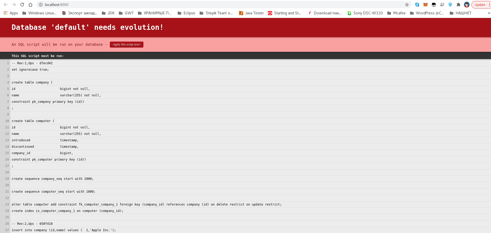
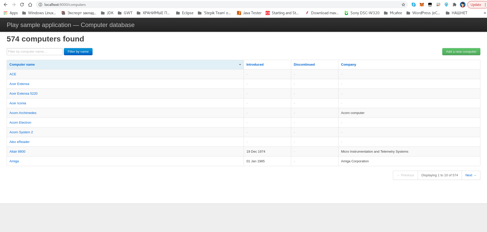

# Scala-Anorm documentation (Lightbend)

* `Anorm documentation` https://playframework.github.io/anorm
* `Scala-Anorm documentation` https://www.playframework.com/documentation/2.0/ScalaAnorm

 
* (`Scala-Anorm documentation`) https://www.playframework.com/modules/scala-0.9.1/anorm

* `Tutorial: Play Framework 2 with Scala, Anorm, JSON, CoffeeScript, jQuery & Heroku` https://jamesward.com/2012/02/21/play-framework-2-with-scala-anorm-json-coffeescript-jquery-heroku

* `Repo` https://github.com/playframework/play-scala-anorm-example
* `Play sample application — Computer database` http://localhost:9000/computers

---

Play включает простой уровень доступа к данным под названием Anorm, который использует простой SQL для взаимодействия с базой данных и предоставляет API для анализа и преобразования результирующих наборов данных.

Anorm не является объектно-реляционным базой

